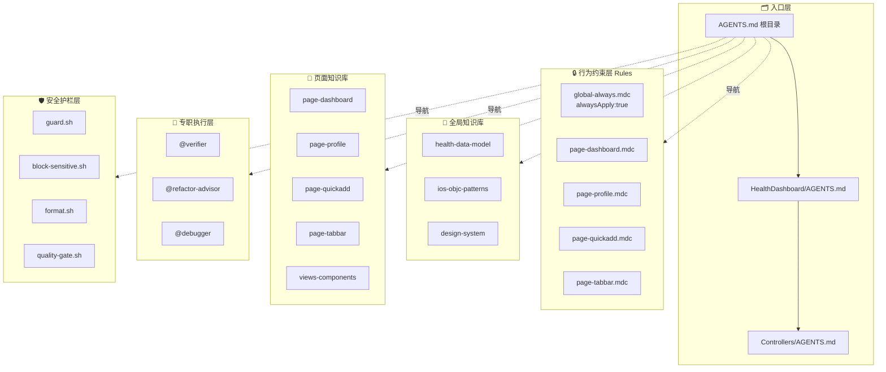
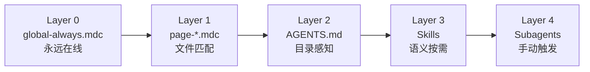

# HealthDashboard · AI Agent 能力体系

> 本文档完整记录项目的 AI Agent 五层能力架构。

---

## 体系总览图



---

## 渐进式加载机制



| 层级 | 触发方式 | Token消耗 |
|---|---|---|
| Layer 0 · global-always | 每次对话，无条件 | 低（固定）|
| Layer 1 · page Rules | 打开匹配文件 | 中 |
| Layer 2 · AGENTS.md | 打开对应目录 | 中 |
| Layer 3 · Skills | Agent 语义判断 | 按需 |
| Layer 4 · Subagents | 手动 @触发 | 专项 |

---

## 完整文件清单

### 🗂 入口层

| 文件 | 触发 | 职责 |
|---|---|---|
| `AGENTS.md` | 自动 | 全局 Index，体系地图 |
| `HealthDashboard/AGENTS.md` | 打开模块文件 | 模块结构，数据流 |
| `HealthDashboard/Controllers/AGENTS.md` | 打开任意VC | 各VC职责，通信规则 |

### 🔒 行为约束层

| 文件 | 触发 | 职责 |
|---|---|---|
| `.cursor/rules/global-always.mdc` | 每次对话 | ObjC规范，Guardrails，Quality Gate |
| `.cursor/rules/page-dashboard.mdc` | HDDashboard* | 仪表盘专属约束 |
| `.cursor/rules/page-profile.mdc` | HDProfile* | 个人中心专属约束 |
| `.cursor/rules/page-quickadd.mdc` | HDQuickAdd* | 快速录入专属约束 |
| `.cursor/rules/page-tabbar.mdc` | HDTabBar* | TabBar专属约束 |

### 🧠 全局知识库

| Skill | 触发 | 职责 |
|---|---|---|
| `.agents/skills/health-data-model/` | 数据读写任务 | HDHealthDataModel 接口，数据关系图 |
| `.agents/skills/ios-objc-patterns/` | 实现设计模式 | Singleton/Delegate/Theme |
| `.agents/skills/design-system/` | UI样式任务 | 颜色，字体，Dark Mode |

### 📱 页面知识库

| Skill | 触发 | 职责 |
|---|---|---|
| `HealthDashboard/.agents/skills/page-dashboard/` | 修改仪表盘 | 数据绑定，卡片布局，UI规格 |
| `HealthDashboard/.agents/skills/page-profile/` | 修改个人中心 | 主题切换，目标设置 |
| `HealthDashboard/.agents/skills/page-quickadd/` | 修改录入页 | Delegate SOP，校验规则 |
| `HealthDashboard/.agents/skills/page-tabbar/` | 修改TabBar | 角标，Tab结构 |
| `HealthDashboard/.agents/skills/views-components/` | 修改View | 5个自定义组件接口 |

### 🤖 专职执行层

| Agent | 触发 | 职责 |
|---|---|---|
| `.cursor/agents/verifier.md` | `@verifier` | 验收代码规范，输出结构化报告 |
| `.cursor/agents/refactor-advisor.md` | `@refactor-advisor` | 重构方案，HITL确认后执行 |
| `.cursor/agents/debugger.md` | `@debugger` | 系统性排查Bug，最小化修复 |

### 🛡 安全护栏层

| 脚本 | 触发时机 | 职责 |
|---|---|---|
| `.cursor/hooks/guard.sh` | Shell命令执行前 | 拦截危险命令 |
| `.cursor/hooks/block-sensitive.sh` | 文件读取前 | 屏蔽.env/证书 |
| `.cursor/hooks/format.sh` | .m/.h编辑后 | 自动clang-format |
| `.cursor/hooks/quality-gate.sh` | Agent完成时 | 质量检查 |

---

## 快速触发指南

```
场景                          触发方式
─────────────────────────────────────────────
改某个VC           →  打开那个文件，Rules自动生效
引入某文件上下文   →  @文件名
需要验收           →  @verifier 或说「帮我验收」
需要重构建议       →  @refactor-advisor
遇到Bug            →  @debugger 或说「这里报错了」
想查项目全貌       →  @AGENTS.md
需要数据模型详情   →  描述任务，Skill自动加载
```

---

## 扩展新页面 SOP

```
1. 新建 .cursor/rules/page-{name}.mdc
   globs: "**/HD{Name}*"

2. 新建 HealthDashboard/.agents/skills/page-{name}/SKILL.md

3. 在 Controllers/AGENTS.md 表格中添加新VC

4. 在根目录 AGENTS.md 能力清单中补充对应行

5. 在 HDTabBarController 注册新Tab（需人工确认）
```
