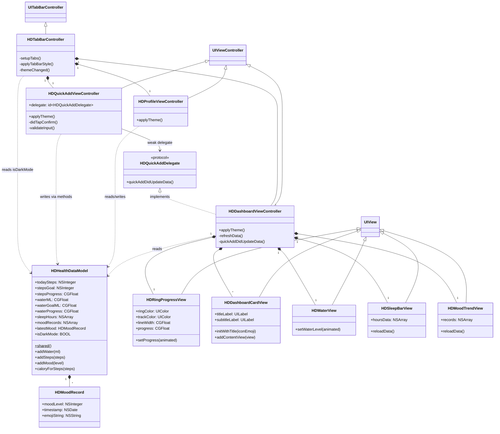
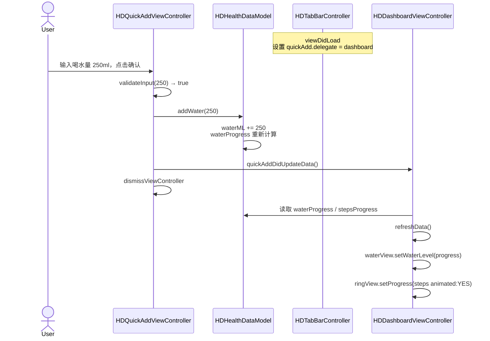
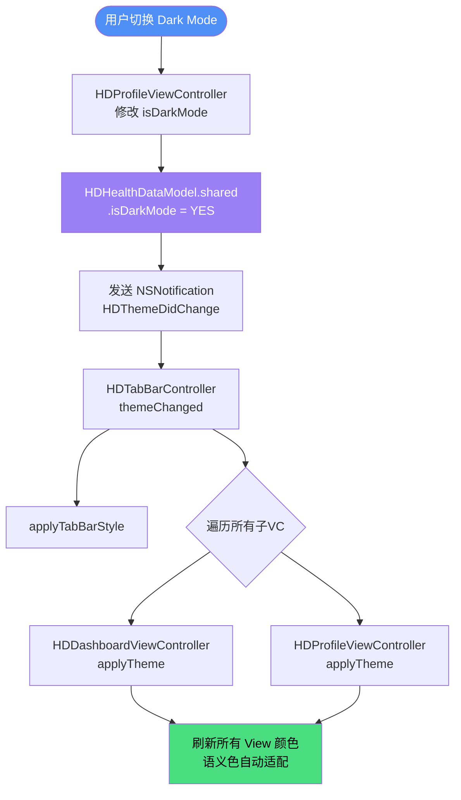

# HealthDashboard · 项目架构文档

> 自动生成于 2026/3/21，基于当前代码库真实结构

---

## 类图（Class Diagram）

```mermaid
classDiagram

%% ── UIKit 基类
class UITabBarController
class UIViewController
class UIView

%% ── Controllers
class HDTabBarController {
    -setupTabs()
    -applyTabBarStyle()
    -themeChanged()
}
class HDDashboardViewController {
    +applyTheme()
    -refreshData()
    -quickAddDidUpdateData()
}
class HDProfileViewController {
    +applyTheme()
}
class HDQuickAddViewController {
    +delegate: id~HDQuickAddDelegate~
    +applyTheme()
    -didTapConfirm()
    -validateInput()
}

%% ── Model
class HDHealthDataModel {
    +shared()$
    +todaySteps: NSInteger
    +stepsGoal: NSInteger
    +stepsProgress: CGFloat
    +waterML: CGFloat
    +waterGoalML: CGFloat
    +waterProgress: CGFloat
    +sleepHours: NSArray
    +moodRecords: NSArray
    +latestMood: HDMoodRecord
    +isDarkMode: BOOL
    +addWater(ml)
    +addSteps(steps)
    +addMood(level)
    +caloryForSteps(steps)
}
class HDMoodRecord {
    +moodLevel: NSInteger
    +timestamp: NSDate
    +emojiString: NSString
}

%% ── Views
class HDRingProgressView {
    +ringColor: UIColor
    +trackColor: UIColor
    +lineWidth: CGFloat
    +progress: CGFloat
    +setProgress(animated)
}
class HDDashboardCardView {
    +titleLabel: UILabel
    +subtitleLabel: UILabel
    +initWithTitle(iconEmoji)
    +addContentView(view)
}
class HDWaterView {
    +setWaterLevel(animated)
}
class HDSleepBarView {
    +hoursData: NSArray
    +reloadData()
}
class HDMoodTrendView {
    +records: NSArray
    +reloadData()
}

%% ── Protocol
class HDQuickAddDelegate {
    <<protocol>>
    +quickAddDidUpdateData()
}

%% ── 继承
UITabBarController <|-- HDTabBarController
UIViewController   <|-- HDDashboardViewController
UIViewController   <|-- HDProfileViewController
UIViewController   <|-- HDQuickAddViewController
UIView <|-- HDRingProgressView
UIView <|-- HDDashboardCardView
UIView <|-- HDWaterView
UIView <|-- HDSleepBarView
UIView <|-- HDMoodTrendView

%% ── 组合
HDTabBarController      "1" *-- "1" HDDashboardViewController
HDTabBarController      "1" *-- "1" HDProfileViewController
HDTabBarController      "1" *-- "1" HDQuickAddViewController
HDDashboardViewController "1" *-- "1" HDRingProgressView
HDDashboardViewController "1" *-- "1" HDWaterView
HDDashboardViewController "1" *-- "1" HDSleepBarView
HDDashboardViewController "1" *-- "1" HDMoodTrendView
HDDashboardViewController "1" *-- "*" HDDashboardCardView
HDHealthDataModel       "1" *-- "*" HDMoodRecord

%% ── Delegate
HDQuickAddDelegate      <|.. HDDashboardViewController : implements
HDQuickAddViewController --> HDQuickAddDelegate : weak delegate

%% ── 数据访问
HDDashboardViewController ..> HDHealthDataModel : reads
HDProfileViewController   ..> HDHealthDataModel : reads/writes
HDQuickAddViewController  ..> HDHealthDataModel : writes via methods
HDTabBarController        ..> HDHealthDataModel : reads isDarkMode
```

---

## 数据流序列图（Sequence Diagram）

```mermaid
sequenceDiagram
    actor User
    participant QA as HDQuickAddViewController
    participant Model as HDHealthDataModel
    participant TB as HDTabBarController
    participant Dash as HDDashboardViewController

    Note over TB: viewDidLoad<br/>设置 quickAdd.delegate = dashboard

    User->>QA: 输入喝水量 250ml，点击确认
    QA->>QA: validateInput(250) → true
    QA->>Model: addWater(250)
    Model->>Model: waterML += 250<br/>waterProgress 重新计算
    QA->>Dash: quickAddDidUpdateData()
    QA->>QA: dismissViewController
    Dash->>Model: 读取 waterProgress / stepsProgress
    Dash->>Dash: refreshData()
    Dash->>Dash: waterView.setWaterLevel(progress)
    Dash->>Dash: ringView.setProgress(steps animated:YES)
```

---

## 主题切换流程图（Flowchart）

```mermaid
flowchart TD
    A([用户切换 Dark Mode]) --> B[HDProfileViewController
修改 isDarkMode]
    B --> C[HDHealthDataModel.shared
.isDarkMode = YES]
    C --> D[发送 NSNotification
HDThemeDidChange]
    D --> E[HDTabBarController
themeChanged]
    E --> F[applyTabBarStyle]
    E --> G{遍历所有子VC}
    G --> H[HDDashboardViewController
applyTheme]
    G --> I[HDProfileViewController
applyTheme]
    H --> J[刷新所有 View 颜色
语义色自动适配]
    I --> J

    style A fill:#4f8ef5,color:#fff
    style C fill:#9b7ff5,color:#fff
    style J fill:#4ade80,color:#000
```
